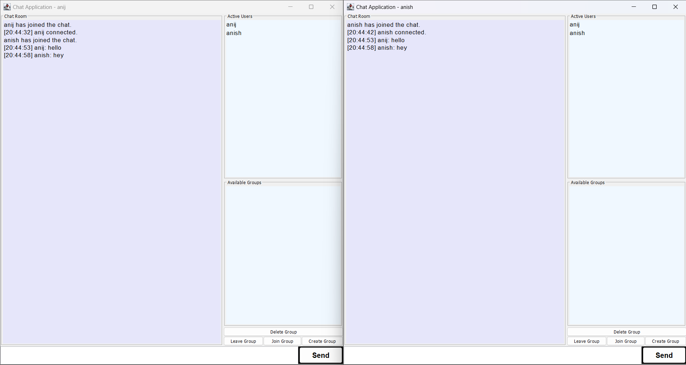

# 💬 Java GUI Chat Application

A feature-rich Java-based GUI Chat Application supporting real-time messaging, group chats, active user tracking, and more. Built with `Swing` and Java networking for seamless client-server communication.

---

## 📋 Table of Contents

- [About the Project](#-about-the-project)
- [Tech Stack](#-tech-stack)
- [Core Components](#-core-components)
- [Setup Instructions](#-setup-instructions)
- [How It Works](#-how-it-works)
- [Screenshots](#-screenshots)
- [Future Enhancements](#-future-enhancements)
- [Contact](#-contact)

---

## 📖 About the Project

This is a fully functional GUI chat system built in Java. It allows users to:
- Log in via a GUI interface
- Send and receive messages in real-time
- Participate in group chats
- View and update online user lists dynamically
- See new users joining instantly

---

## 🛠️ Tech Stack

- **Language:** Java
- **GUI Library:** Swing
- **Networking:** Sockets (TCP)
- **Architecture:** Client-Server
- **IDE:** IntelliJ / Eclipse (Optional)

---

## 🔧 Core Components

| Component      | Description                                   |
|----------------|-----------------------------------------------|
| `ChatServer.java` | Manages client connections, groups, message broadcasting, and online user tracking |
| `ChatClient.java` | GUI client to send/receive messages and interact with the server |
| GUI            | Java Swing interface for chat and user lists  |

---

## ⚙️ Setup Instructions

1. Clone this repository:
   ```bash
   git clone https://github.com/your-username/java-gui-chat-app.git
   cd java-gui-chat-app/src/chatapp
   ```

2. Compile the server and client:
   ```bash
   javac ChatServer.java
   javac ChatClient.java
   ```
   
3. Run the server:

   ```bash
   java ChatServer
   ```

4. Run multiple clients:

    ```bash
    java ChatClient
    ```

---

## 🔄 How It Works

    Login: Client connects to the server and registers the username.

    Message Handling: All messages are sent to the server, which broadcasts them to all connected clients.

    User Management: New users are automatically shown in the online list for every connected client.

    Group Messaging: Clients can send messages to groups; the server handles correct routing.

    Updates: Group list and user list are updated live.

## 🖼️ Screenshots

### Chat UI


## 🚀 Future Enhancements

    Authentication with passwords

    Persistent database (MySQL/PostgreSQL)

    File sharing support

    Private (one-to-one) messaging

    Typing indicators and message status (sent, delivered, read)

## 📬 Contact

Anij Mehta<br>
🔗 [GitHub](https://github.com/anij-mehta)<br>
🔗 [LinkedIn](https://www.linkedin.com/in/anij-mehta)
